# Jeedom WidGet Light-all-picture

Widget dédié aux lumières avec choix multiple pour l'affichage des images.  
Peut être utiliser en version desktop et mobile.  

Voici l'ensemble des images disponibles pour ce widget, avec la valeur de la variable "equipImg".  
  
|  Numéro  |   Icon OFF  |   Icon ON   |   Valeur "equipImg"   |
| :------: | :---------: | :---------: | :-------------------: |
| 1 | 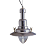 | 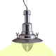 | **Lampe-bateau-alu** |
| 2 | 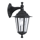 | 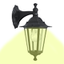 | **Lampe-ext-ancien-metal** |
| 3 | 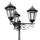 |  | **Lampe-ext-ancien-metal-x3** |
| 4 | 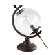 |  | **Lampe-mapmonde-verre** |
| 5 | 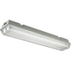 | 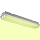 | **Lampe-neon-x2** |
| 6 | 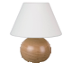 | 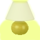 | **Lampe-pied-bois** |
| 7 | 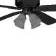 | 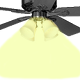 | **Lampe-plafond-bois-2** |
| 8 | 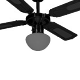 | 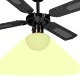 | **Lampe-plafond-bois** |
| 9 |  |  | **Lampe-suspendu-metal-x12** |
| 10 | 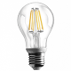 |  | **Led-cob** (défaut) |
| 11 | 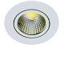 | 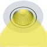 | **Spot-cob** |  
  
## Utilisation du widget
Tout d'abord, installer le widget via le market de Jeedom, ou cliquer sur ce [lien](https://www.jeedom.com/market/index.php?v=d&p=market&author=lolo-95 "lien vers le market Jeedom") .  
Ensuite, aller dans le module lampe qui vous intéresse, par exemple *plugins* / *programmation* / *Virtuel* / *Lampe Bureau* .  
Choisir l'onglet *Commandes*, dans un premier temps on clic sur la roue crantée au bout de la ligne *On* .  
On va sur l'onglet *Affichage*, on sélectionne *Light-all-picture (widget)* dans le tableau *Widget* .
Puis, dans *Paramètres optionnels widget* on clic sur *+ ajouter* à droite, une ligne supplémentaire apparaît en dessous, dans *Nom* on écrit *equipImg*, puis dans *valeur* on entre le nom qui se trouve à droite dans le tableau ci-dessus, par exemple *Spot-cob*, ne pas oublier d'enregistrer les modification avec le bouton *Enregistrer* en haut à droit de la fenêtre, puis on ferme la fenêtre.  
Dans un deuxième temps on reproduit la même chose avec la ligne *Off* de l'onglet *Commandes* .......  
Voilà vous avez configuré votre widget, allez dans *Acceuil* / *Dashboard* / *Bureau* , le widget *Lampe bureau* à changer avec l'image du spot-cob, cliquer dessus pour changer son état.  
  
## Changelog
Août 2019 : création du widget.