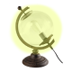

# Jeedom WidGet Light-all-picture

Widget dédié au lumières avec choix multiple pour l'affichage des images.  

Voici l'ensemble des images disponibles pour ce widget, avec la valeur de la variable "equipImg".  
  *   **Lampe-bateau-alu**
  *   **Lampe-ext-ancien-metal**
  *   **Lampe-ext-ancien-metal-x3**
  *   **Lampe-mapmonde-verre**
  *   **Lampe-neon-x2**
  *   **Lampe-pied-bois**
  *   **Lampe-plafond-bois-2**
  *   **Lampe-plafond-bois**
  *   **Lampe-suspendu-metal-x12**
  *   **Led-cob**
  *   **Spot-cob**  
  
## Utilisation du widget